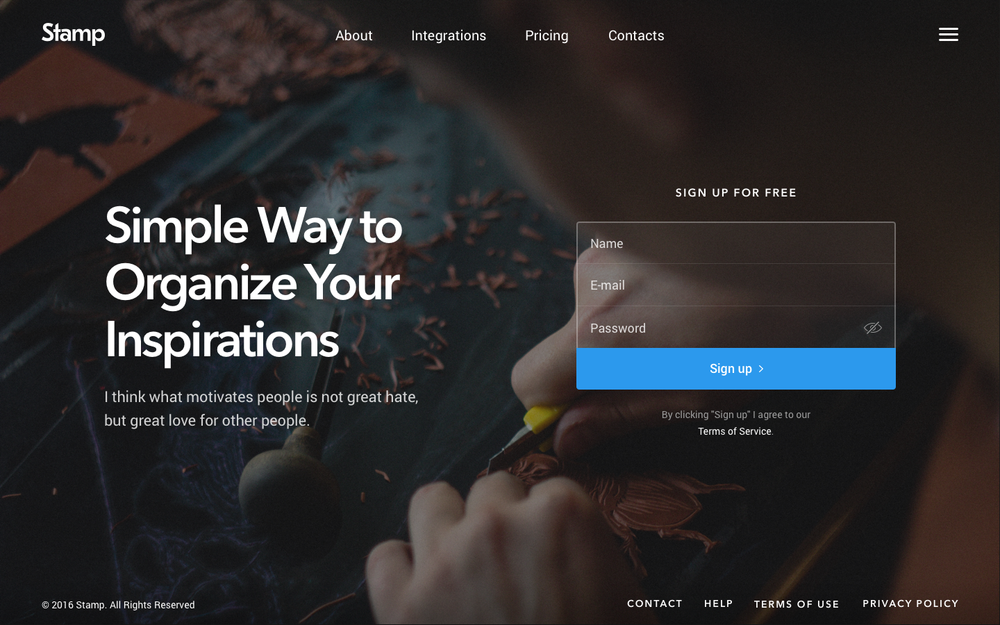

# THESIS

### See it live here: https://em-estabillo-thesis.netlify.com/

Front End challenge:
Create a responsive HTML page based on the following design with no frontend frameworks or libraries (bootstrap, react, font awesome, etc.):

### Tools I used:

SCSS, BEM, Flexbox, Grid, Colorzilla (for color matching), npm (for Sass), Netlify
